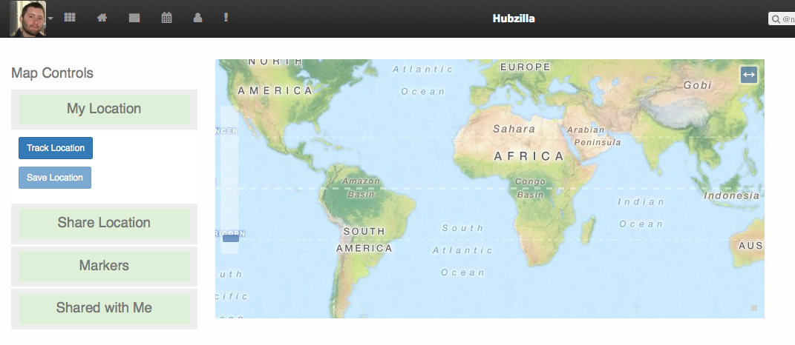

# Hubzilla Plugins
---
[Hubzilla](http://hubzilla.org) is a powerful platform for creating interconnected websites featuring a decentralized identity, communications, and permissions framework built using common webserver technology. 

This is a repository of **plugins** (also known as **addons**) that extend the functionality of the core Hubzilla installation in various ways.

### Installation


To install, use the following commands (assuming `/var/www/` is your hub's web root):

```
cd /var/www/
util/add_addon_repo https://gitlab.com/zot/hubzilla-plugins.git plugins
util/update_addon_repo plugins
```
Then enable the individual plugins through the admin settings interface.

## Plugins
---
### Embed Photos
Adds a button to the post editor that lets you browse album galleries and select linked images to embed in the post.
### Keyboard Shortcuts
Provides keyboard shortcuts to some Hubzilla pages to aid post navigation and post composition.
### ownMapp


[ownMapp](https://grid.reticu.li/page/ownmapp/ownmapp) is an open-source web app for private, self-hosted geolocation services. Originally implemented as an independent web app, current development of the project is in the form of a robust plugin for [Hubzilla](http://hubzilla.org) ([source code](https://github.com/redmatrix/hubzilla)), leveraging the platforms powerful array of decentralized identity services, global access control and communications network.

Current capabilities include 

  * interactive personal location tracking, with ability to share your location securely with your existing contacts or groups of contacts
  * creating static markers that you can share with others
  * integration with Hubzilla calendar events

[Follow project updates and join the discussion on the grid](https://grid.reticu.li/channel/ownmapp).


#### Installation


To install, use the following commands (assuming `/var/www/` is your hub's web root):

```
cd /var/www/
util/add_addon_repo https://gitlab.com/zot/ownmapp.git map
util/update_addon_repo map
```

Then enable the plugin through the admin settings interface.